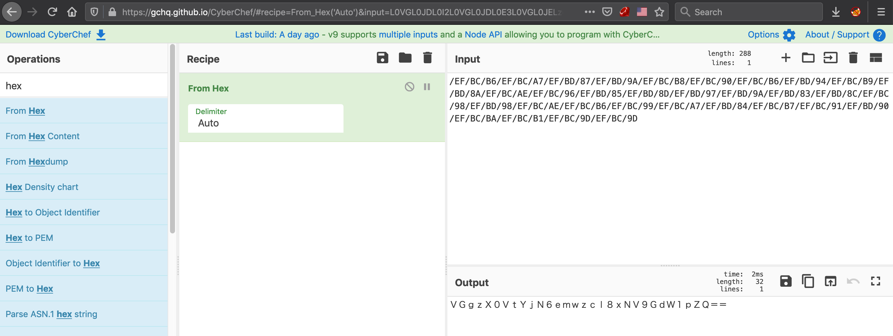

# Fraud(1) Whistle blowing
  
```
Mr. Horii is in charge of investigation of a case of embezzlement that occurred in the company.
While he has not been able to find any clue, he received an email from an unknown sender.

/EF/BC/B6/EF/BC/A7/EF/BD/87/EF/BD/9A/EF/BC/B8/EF/BC/90/EF/BC/B6/EF/BD/94/EF/BC/B9/EF/BD/8A/EF/BC/AE/EF/BC/96/EF/BD/85/EF/BD/8D/EF/BD/97/EF/BD/9A/EF/BD/83/EF/BD/8C/EF/BC/98/EF/BD/98/EF/BC/AE/EF/BC/B6/EF/BC/99/EF/BC/A7/EF/BD/84/EF/BC/B7/EF/BC/91/EF/BD/90/EF/BC/BA/EF/BC/B1/EF/BC/9D/EF/BC/9D

The email appears to contain important information about the incident, but the essential parts are replaced by meaningless strings. Mr. Horii has no idea about what to do.
Find information hidden in this email for Mr. Horii.

flag format: flag{[A-Za-z0-9 symbols]}
```
  
We got the string of hex.  
Try to unhex.  


We got the Base64 string: `VGgzX0VtYjN6emwzcl8xNV9GdW1pZQ==`.  
The flag is flag{Th3_Emb3zzl3r_15_Fumie}
