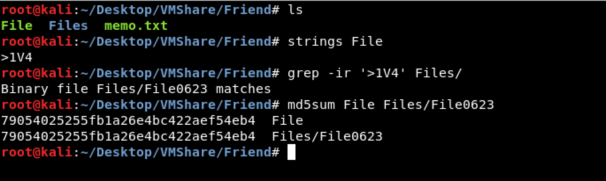

# Friend (MISC - 100)  
  
```
Among File001 to File999, find files with the same features with File.
Identify the files and also provide evidence for the commonality.

flag format: flag{File<4 digits>_lowercase alphanumeric}
```
  
The challenge file can be download [here](Friend_0ad3d2abf5ededb11275ce89417f314e.zip).  
  
We tried to look for a similar file as `File`.  
And we found the file `File0623`.  
The md5sum of `File` and `File0623` are the same.  
  
  
The flag is flag{File0623_79054025255fb1a26e4bc422aef54eb4}
