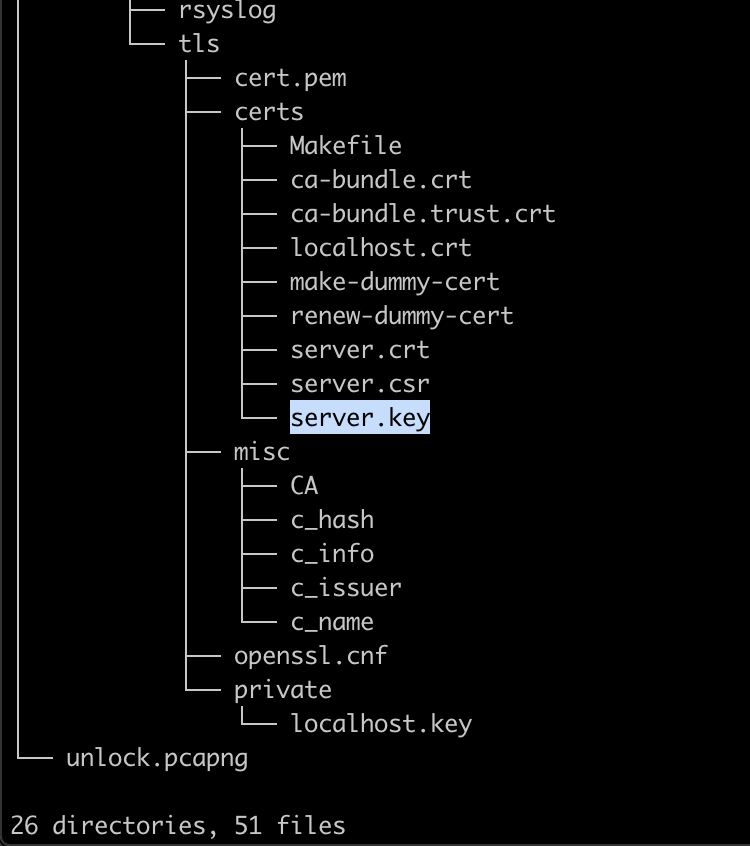
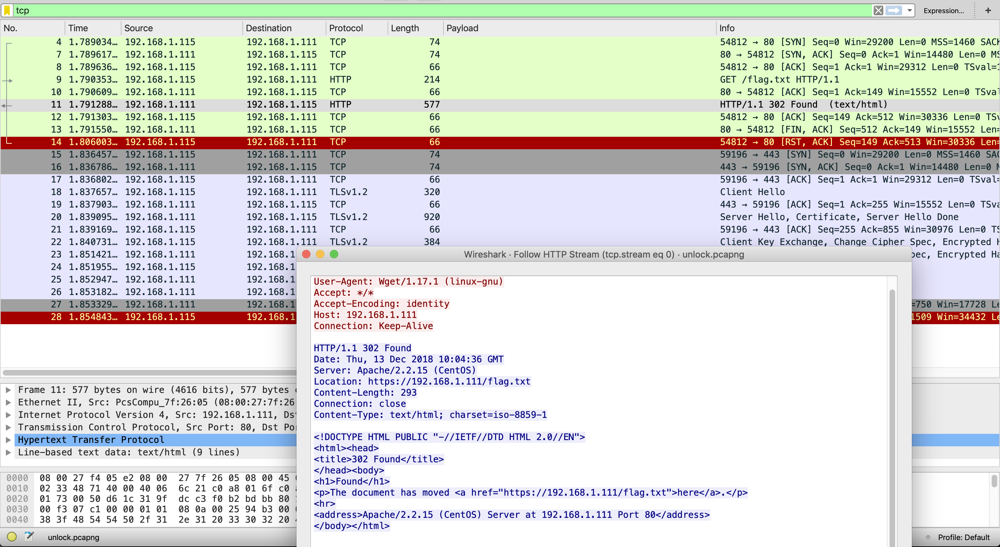
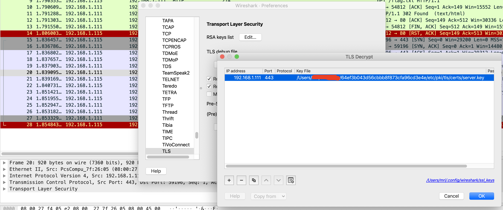

# Unlock (Binary - 150)

The challenge file can be download [here](64ef3b043d56cbbb8f873cfa96cd3e4e.zip).  
  
I use `tree` command to view the stucture of files, and the private key `server.key` was found.  

  
The `unlock.pcapng` is the main challenge file, open it with Wireshark.  
From the `unlock.pcapng` file ,there is the GET request to read the flag and the server redirect user in order to use HTTPS instead of HTTP.  

  
From this point, I knew that the challenge is to decrypt the TLS packets.  
Next, add the `server.key` into Wireshark.

  
Now I can read the TLS by right clicking > Follow > TLS Stream.  
[https](https.png)
  
The flag is flag{cf8236571e9dd3bcaf44b188bba4f15d}
