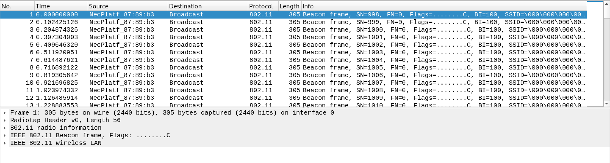
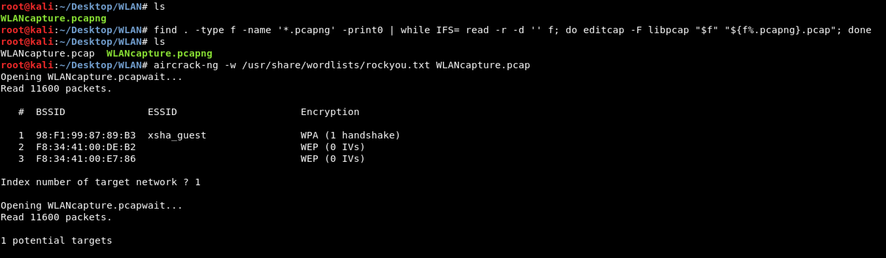
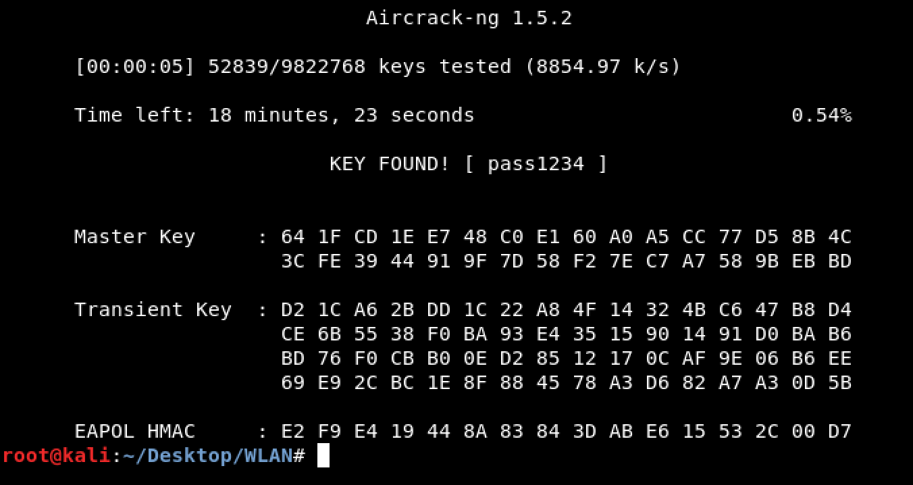
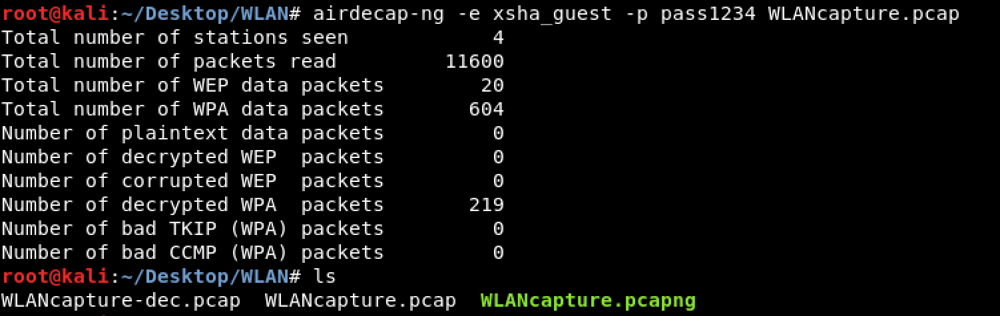
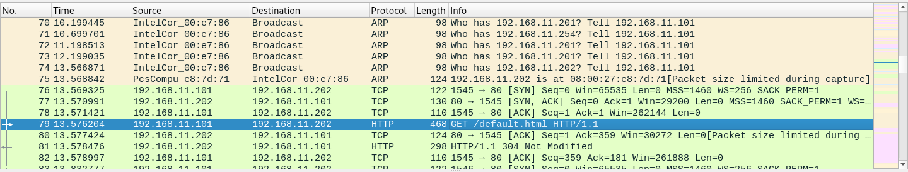

# WLAN (Network - 150)
  
The challenge file can be downloaded [here](WLANcapture_2c222708abc1c8406992bbb1e6004615.zip).  
The goal of this challenge is find the IP address of the server that requested by client.  
  
We got the wireless packets captured file.  
  
  
Try to convert .pcapng to .pcap file and decrypt the packets.  
  
  
There is only 1 ESSID in the PCAP file, that is the target!
And the password of that access point is `pass1234`.  
  
  
Next, decrypt the PCAP file with `airdecap-ng`.  
  
  
We got the new decrypted file, `WLANcapture-dec.pcap`.  

The flag is flag{192.168.11.202}