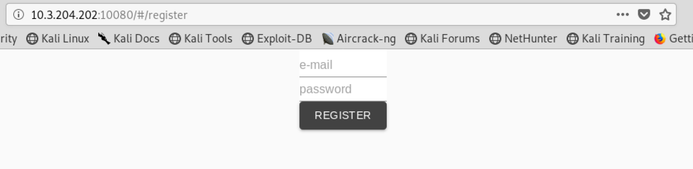
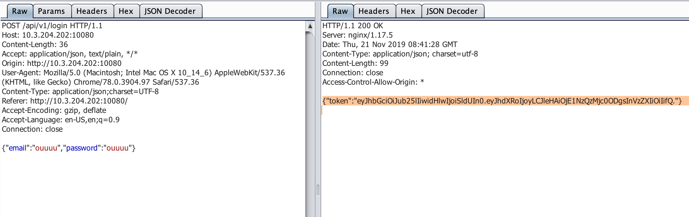
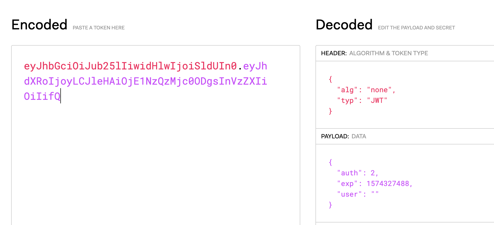
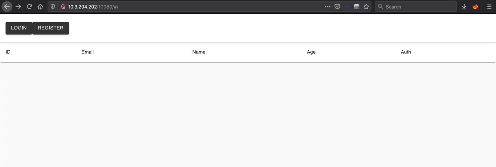
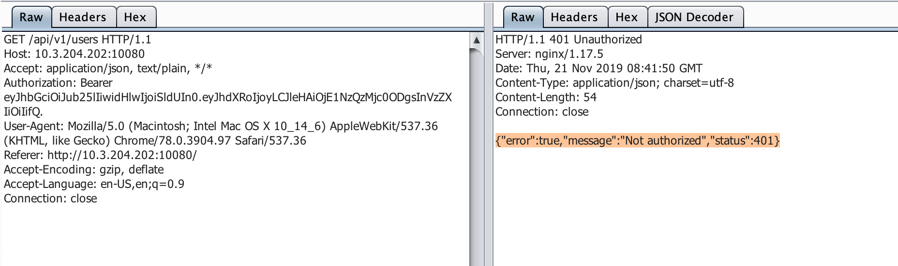
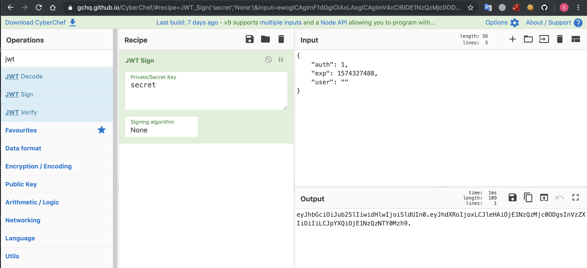

# broken user management (Web - 150)

The website was running at 10.3.204.202:10080
First register at http://10.3.204.202:10080

The server will response the JWT token when you logged in.

The JWT token contain auth value but the token does not has signature and the algorithm.

And then when tried to access the main page server respond with 401 Unauthorized.

Since JWT token does not has signature and the algorithm. We can sign the token with auth = 1 by our self by using https://gchq.github.io/CyberChef/.

After replace Authorization header with new JWT the server response with all user data.

The flag is flag{SXMgdGhlIGNvcnJlY3QgYW5zd2VyISBDb25ncmF0cyE}