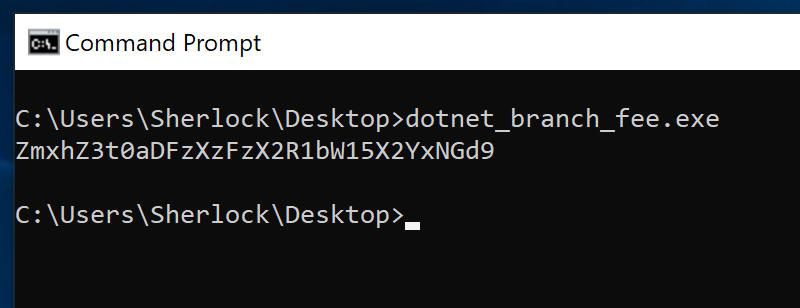
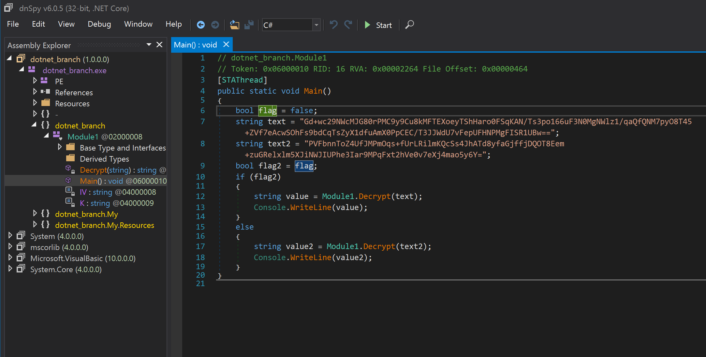
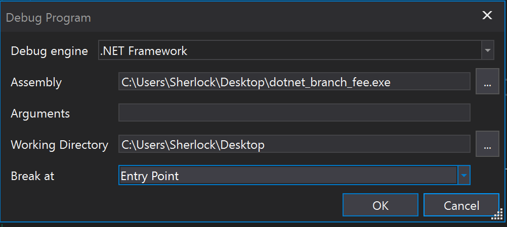
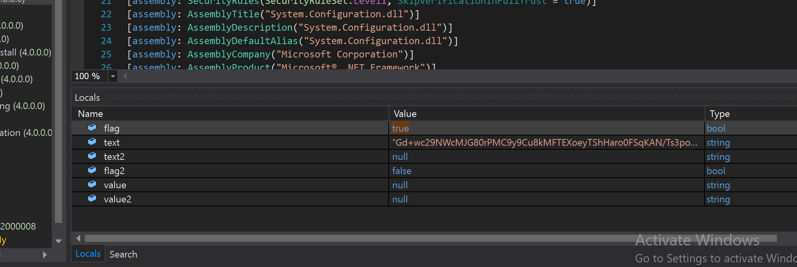

# dotnet_branch (Binary - 120)

Download the execution file [here](./dotnet_branch_fee.exe).

After running the file the Base64 encoded string was printed out.

When we decode it we got the fake flag "flag{th1s_1s_dummy_f14g}"

Since the exe file was written in .Net we can decompile it with dnSpy.

There are two texts that can be decrypt now we have to set the flag to true to reach the true condition of if-block.

dnSpy has ability to change the variable when the program was running. First set the break at to "Entry Point".

After that set the value of the flag to true.

then the Base64 encoded flag was printed out

    ZmxhZ3tkb3ROM1RfcHIwZ3I0bV9kZTZ1Z2cxbmdfMXNfZTRzeX0=

The flag is cflag{dotN3T_pr0gr4m_de6ugg1ng_1s_e4sy}