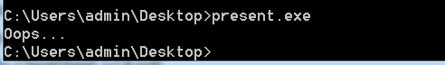
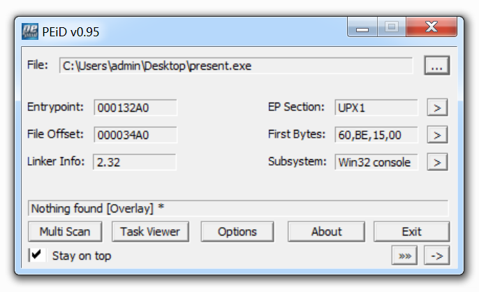
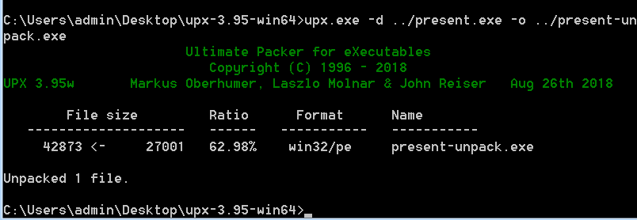
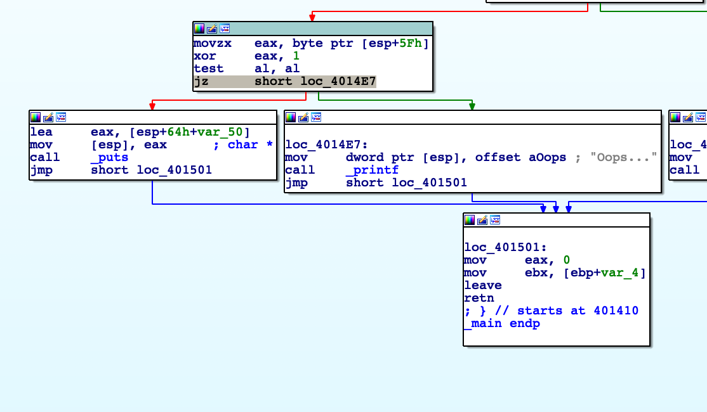

# present (Binary - 100)
  
The challenge file can be downloaded [here](present.zip).  

After extracting the ZIP file, we got the EXE file named `present.exe`.  
Execute the file, only text `Oops...` returned.  

  
By checking the EXE file with `PEiD`, we found that it was packed with UPX which can be easily unpacked as follows:  

  
  
The file after unpacking is [present-unpack.exe](present-unpack.exe).  
Next step is load the unpacked file to IDA, and search for the string `Oops`.  
  
  
There is the condition `jz short loc_4014E7` before printing `Oops`, so we change the opcode `jz` to `jnz`,
  
Try to run the EXE file again, and got the Base64 string.  
`ZmxhZ3tURVNUX0VBU1lfSVNfREVCVUdHRVJfUFJFU0VOVCEhfQ==`

The flag is flag{TEST_EASY_IS_DEBUGGER_PRESENT!!}
