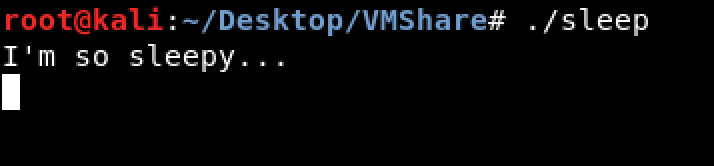
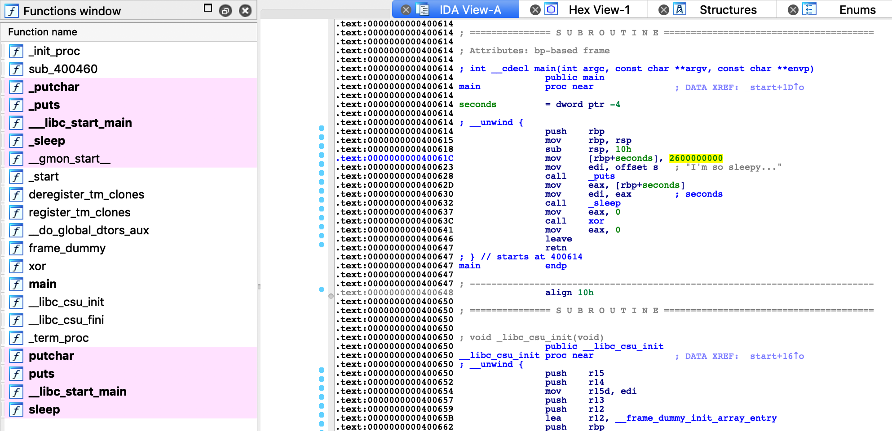
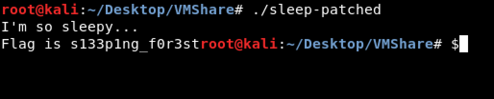

# sleepy (Binary - 100)

Download the challenge [here](sleep).  
  
Running the binary file. It took very long delay.

  
Load the binary file into IDA, search for the string "sleepy", there will be a number for the delay (0x2600000000 in this case).  
  
  

Patch the number to 0 (zero), and save as a [new file](sleep-patched).  

